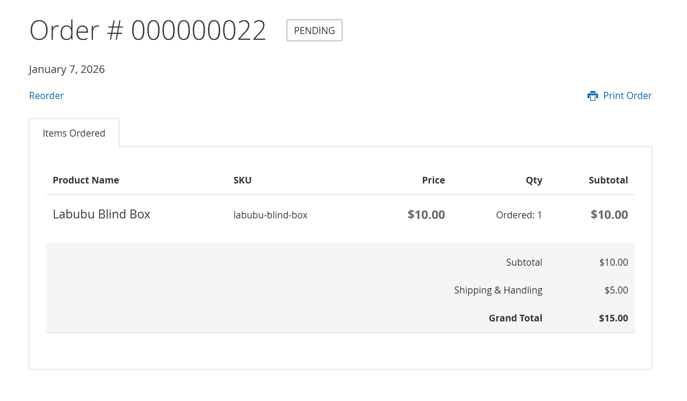
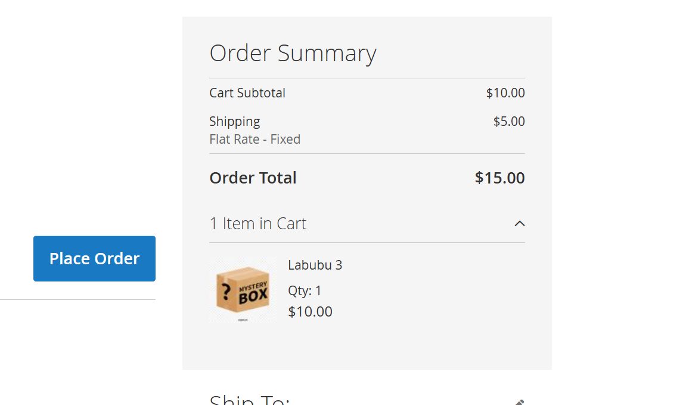
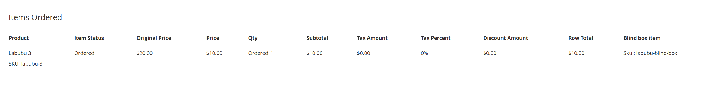

# Hmh_BlindBoxProduct

Blind box product support for Magento.

## Features

- Allow selling blind box products that are automatically replaced by a random product from a predefined pool.
- Customers do not see the actual product until they receive it.
- The actual product is visible in the admin area.
- Preserve and store the original blind box SKU on quote and order items.
- Override order confirmation email item name/SKU display for blind box items.
- Update minicart item name and thumbnail based on blind box SKU.

## Configuration

Admin path:

```
Stores > Configuration > HMH > Blind Box Product
```

## Notes

- This module ships a custom email item template and view model.
- Enable/disable behavior via the `hmh_blindboxproduct/general/enabled` config flag.

## How-to







