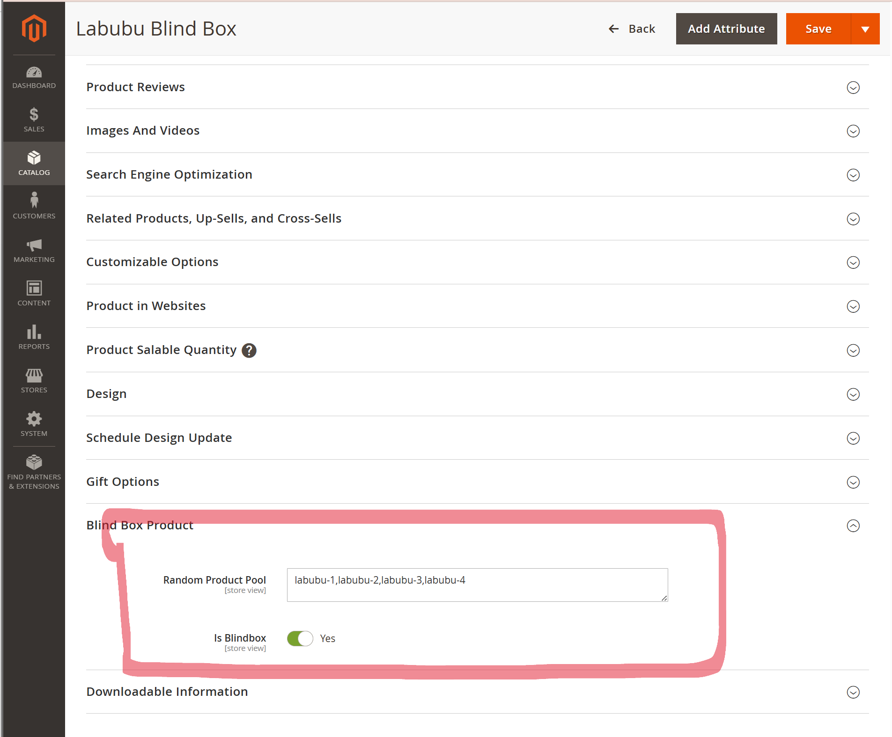
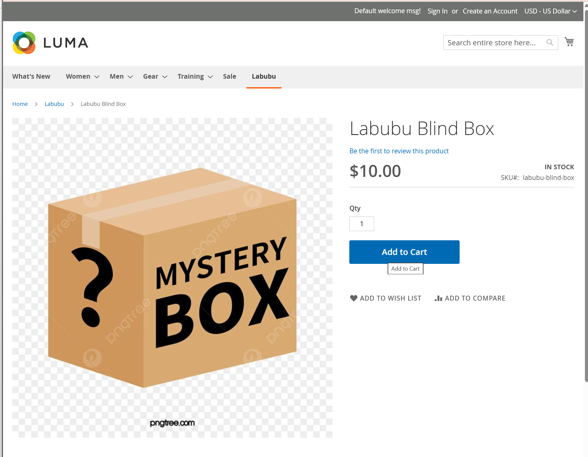
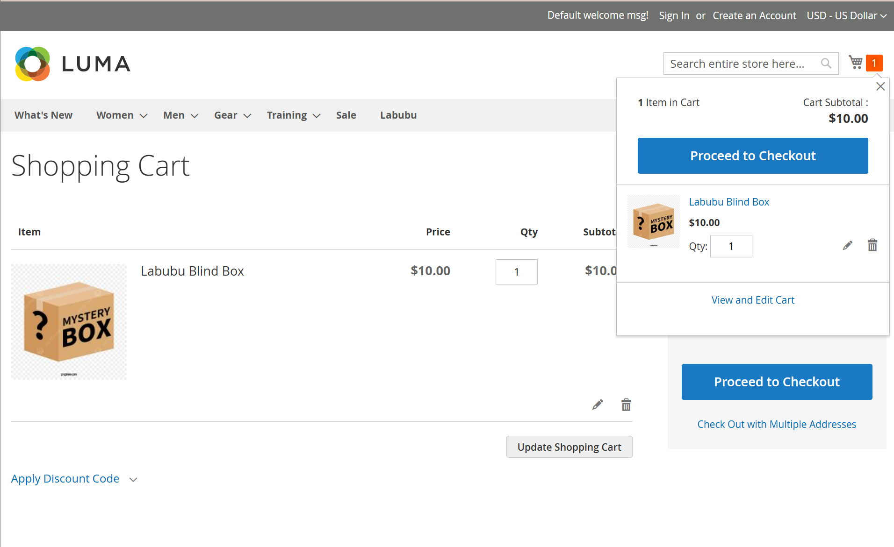
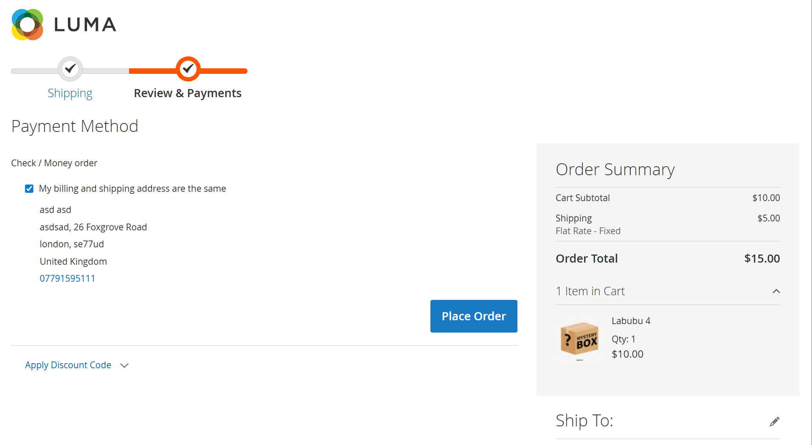
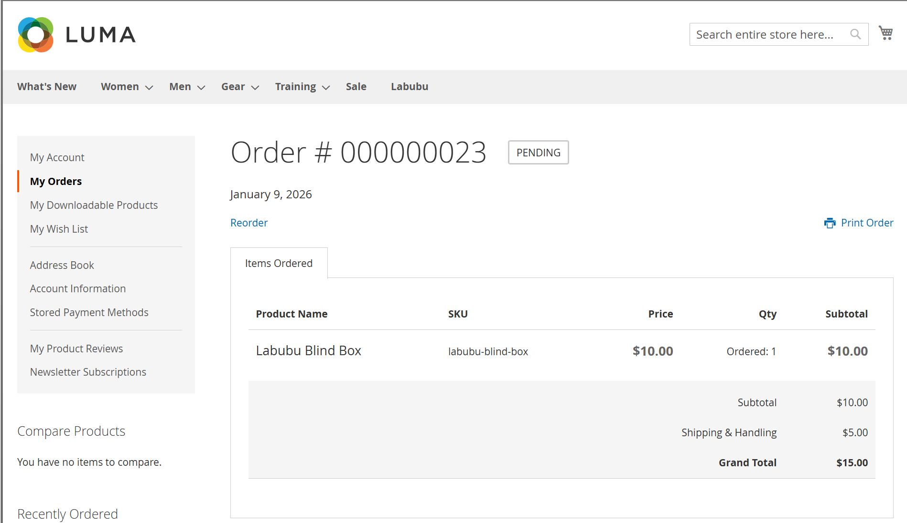
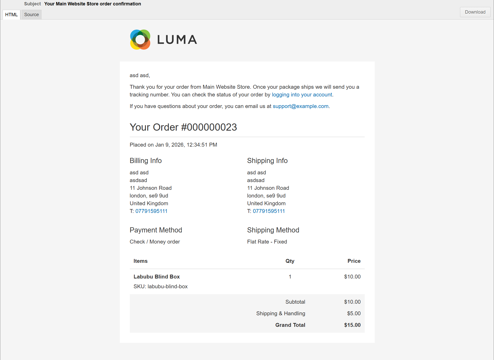
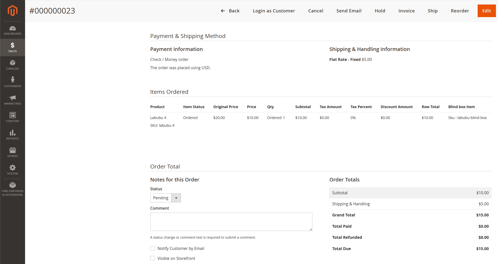

# Hmh_BlindBoxProduct

Blind box product support for Magento.

## Features

- Allow selling blind box products that are automatically replaced by a random product from a predefined pool.
- Customers do not see the actual product until they receive it.
- The actual product is visible in the admin area.
- Preserve and store the original blind box SKU on quote and order items.
- Override order confirmation email item name/SKU display for blind box items.
- Update minicart item name and thumbnail based on blind box SKU.

## Configuration

Admin path:

```
Stores > Configuration > HMH > Blind Box Product
```

## Notes

- This module ships a custom email item template and view model.
- Enable/disable behavior via the `hmh_blindboxproduct/general/enabled` config flag.

## How-to


Configure a product as a blind box and define the pool of real products it can resolve to.
Each pool item is a normal SKU, and the random selection happens when the blind box is purchased.


Add the blind box product to the basket from the storefront like any other item.
Customers only see the blind box SKU and name at this stage.


The cart shows the blind box item, not the hidden product that will be fulfilled.
This keeps the actual selection private until after purchase.


The blind box item remains visible throughout checkout for pricing and totals.
No real SKU is revealed in the checkout flow.


Customers see the blind box item in My Orders for consistency with the storefront experience.
The original blind box SKU is preserved on the order item.


The order confirmation email lists the blind box SKU and name.
This avoids revealing the actual product in customer-facing emails.


Admins see the real product in order details for fulfillment and customer support.
The blind box SKU remains available for traceability.
